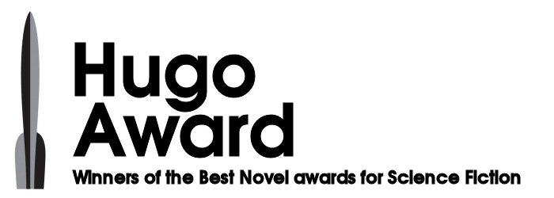

# THE HUGO AWARDS API V1

<p align="center">
  
</p>


This project will show case how to build a prototype API using Python and the Flask web framework. Our API will take the form of a distant reading archive—a book catalog that goes beyond standard bibliographic information to include data of interest to those working on digital projects. In this case, besides title and date of publication, our API will also serve the first sentence of each book. This should be enough data to allow us to envision some potential research questions without overwhelming us as we focus on the design of our API

The database downloaded for this lesson has 67 entries, one for each of the winners of the Hugo Award for best science fiction novel between 1953 and 2014. The data set includes the novel’s `title`, `author`, `year of publication`, and `first sentence`.

Our API allows users to filter by three fields: `id`, `published (year of publication)`, and `author`.

## Setting up the Project

- Clone the repository using

```bash
git clone https://github.com/RdEl00/The-Hugo-Awards-API.git
```

- Open the terminal/cmd and navigate to the project folder.

```bash
cd The-Hugo-Awards-API
```

- For this project, you will need Python 3 and the Flask web framework. 

```bash
pip install python3 flask
```
## Usage

- Now run the `api_final.py` using
- Once the server is running, visit our route URL to view the data in the catalog:

    >http://127.0.0.1:5000/api/v1/resources/books/allv

- Try out the filtering functionality with these HTTP requests

    >http://127.0.0.1:5000/api/v1/resources/books/all

    >http://127.0.0.1:5000/api/v1/resources/books?author=Connie+Willis

    >http://127.0.0.1:5000/api/v1/resources/books?author=Connie+Willis&published=1999

    >http://127.0.0.1:5000/api/v1/resources/books?published=2010
    
